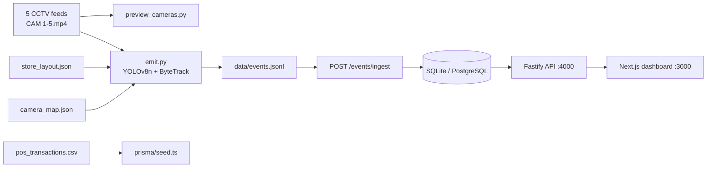

# Store Intelligence Platform

Production-oriented implementation that turns CCTV footage and POS data into offline retail intelligence: visitor counts, conversion rate, zone heatmaps, queue signals, and rule-based anomalies.

**North star metric:** offline store conversion rate = visitors who purchased ÷ unique visitors (staff excluded).

## Architecture Diagram



## Folder Structure

```
store-intelligence/
├── apps/
│   ├── api/          # Fastify backend (routes → controllers → services → repositories)
│   └── web/          # Next.js 14 dashboard (Zustand)
├── packages/
│   ├── shared/       # Types, Zod schemas, analytics utils (single source of truth)
│   └── pipeline/     # detect.py, tracker.py, emit.py, preview_cameras.py
├── data/
│   ├── videos_path.txt
│   ├── camera_map.json
│   ├── store_layout.json
│   ├── pos_transactions.csv
│   ├── events.jsonl          # generated
│   ├── previews/             # camera verification images
│   └── CAMERA_ASSIGNMENTS.md
├── docs/             # DESIGN.md, CHOICES.md
├── scripts/          # docker-api.sh, docker-web.sh
└── docker-compose.yml
```

## CCTV Dataset (this project)

| Item | Location |
|------|----------|
| Raw videos | `C:\Users\sreya\Downloads\resources\CCTV Footage-20260529T160731Z-3-00144614ea\CCTV Footage` |
| Files | `CAM 1.mp4` … `CAM 5.mp4` (~2–2.5 min each, 1920×1080) |
| Raw POS CSV | `C:\Users\sreya\Downloads\resources\Brigade_Bangalore_10_April_26 (1)bc6219c.csv` |
| Aligned POS CSV | `data/pos_transactions.csv` (Mapped using `convert_pos.py` to match event dates) |
| Layout | `data/store_layout.json` |

### Verified camera mapping

Preview frames in `data/previews/` were reviewed and `data/camera_map.json` was corrected:

| File | Logical camera | Scene |
|------|----------------|-------|
| CAM 1 | `ENTRY_CAMERA` | Main sales floor, shopper traffic |
| CAM 2 | `FLOOR_CAMERA` | Cosmetics aisles, makeup station |
| CAM 3 | `AUX_CAMERA_1` | Store entrance / glass doors |
| CAM 4 | `AUX_CAMERA_2` | Stock room (low shopper signal) |
| CAM 5 | `BILLING_CAMERA` | Checkout counter + scanner |

See `data/CAMERA_ASSIGNMENTS.md` for the full verification notes.

## Setup

**Requirements:** Node 20+, Python 3.10+, pip, optional Docker.

```bash
# Node / monorepo
corepack enable   # or: npx pnpm@9.12.0 <cmd>
pnpm install
cp .env.example .env

pnpm db:generate
pnpm db:migrate
```

**Python (detection pipeline):**

```bash
pip install -r packages/pipeline/requirements.txt
```

Default `.env` uses SQLite at `file:./apps/api/prisma/dev.db`.

## Installation

| Command | Purpose |
|---------|---------|
| `pnpm install` | Install monorepo dependencies |
| `pnpm db:generate` | Generate Prisma client |
| `pnpm db:migrate` | Apply migrations |
| `pnpm db:seed` | Load POS CSV |
| `pnpm db:seed:events` | Load `data/events.jsonl` into DB |

## Pipeline Execution

### 1. Preview cameras (verify assignments)

Fast single-frame YOLO preview (~15s). Outputs JPGs + manifest:

```bash
pnpm pipeline:preview
```

Open `data/previews/*_detections.jpg`. Adjust `data/camera_map.json` if needed.

### 2. Generate events from CCTV

Full YOLOv8n + ByteTrack pass on all five clips (~5–6 min on CPU):

```bash
pnpm pipeline:cctv
```

Or explicitly:

```bash
python packages/pipeline/emit.py \
  --videos "C:/Users/sreya/Downloads/resources/CCTV Footage-20260529T160731Z-3-00144614ea/CCTV Footage" \
  --layout ./data/store_layout.json \
  --camera-map ./data/camera_map.json \
  --output ./data/events.jsonl
```

### 3. Load events into the database

```bash
# Windows PowerShell
$env:DATABASE_URL="file:./apps/api/prisma/dev.db"
npx tsx apps/api/prisma/seed.ts

# Or
pnpm db:seed:events
```

### 4. Ingest via API (alternative)

POST batches of up to 500 events (idempotent by `event_id`):

```bash
curl -X POST http://localhost:4000/events/ingest \
  -H "Content-Type: application/json" \
  -d @payload.json
```

## Event Schema

Validated in `packages/shared/src/schemas/event.ts`.

```json
{
  "event_id": "uuid-v4",
  "store_id": "store_001",
  "camera_id": "ENTRY_CAMERA",
  "visitor_id": "visitor_session_track_3",
  "event_type": "ENTRY",
  "timestamp": "2026-05-30T10:00:00.000Z",
  "zone_id": "ENTRY",
  "dwell_ms": 0,
  "is_staff": false,
  "confidence": 0.84,
  "metadata": {}
}
```

**Event types:** `ENTRY`, `EXIT`, `REENTRY`, `ZONE_ENTER`, `ZONE_EXIT`, `ZONE_DWELL`, `BILLING_QUEUE_JOIN`, `BILLING_QUEUE_ABANDON`.

**POS correlation:** visitor counts as converted if present in `CASH_COUNTER` within **5 minutes before** transaction timestamp.

## API Documentation

Base URL: `http://localhost:4000`

| Method | Path | Description |
|--------|------|-------------|
| `POST` | `/events/ingest` | Validate, dedupe, store ≤500 events |
| `GET` | `/stores/:id/metrics` | Visitors, conversion, dwell, queue, abandonment |
| `GET` | `/stores/:id/funnel` | ENTRY → ZONE → BILLING → PURCHASE |
| `GET` | `/stores/:id/heatmap` | Zone visits, dwell, normalized score |
| `GET` | `/stores/:id/anomalies` | QUEUE_SPIKE, CONVERSION_DROP, DEAD_ZONE |
| `GET` | `/health` | Status, last event time, stale feed flag |

Store ID for this dataset: `store_001`.

## Dashboard Usage

```bash
pnpm --filter @store/api dev   # http://localhost:4000
pnpm --filter @store/web dev   # http://localhost:3000
```

The dashboard polls every 10 seconds and shows visitors, conversion %, queue depth, funnel, heatmap, and anomalies. All values are computed from ingested events (no hardcoded metrics).

## Testing

```bash
pnpm test
```

Covers empty store, staff exclusion, re-entry, duplicate ingest, funnel/heatmap/anomaly math, and API integration. Each test file starts with `PROMPT:` and `CHANGES MADE:` headers per challenge requirements.

## Docker Usage

```bash
docker compose up --build
```

Starts API (migrate + seed) and web on SQLite. API `:4000`, dashboard `:3000`.

## pnpm Scripts

| Script | Action |
|--------|--------|
| `pnpm dev` | Turbo dev (api + web) |
| `pnpm test` | Run all package tests |
| `pnpm pipeline:preview` | Camera preview JPGs |
| `pnpm pipeline:cctv` | Full CCTV → events.jsonl |
| `pnpm db:seed:events` | Seed events from JSONL |

## Known Limitations

- **Zone mapping** uses normalized bounding-box positions against `store_layout.json` polygons without per-camera homography; zone labels are approximate until cameras are calibrated.
- **CAM 4** covers a stock room; limited shopper zone signal.
- **Cross-camera identity** links aux cameras to the active `ENTRY_CAMERA` session rather than full Re-ID embeddings.
- **Short clips** (~2.5 min) — analytics confidence is `LOW` in heatmap when sessions &lt; 20.

## Future Improvements

- Per-camera homography calibration from floor reference points
- OSNet / DeepSORT Re-ID for cross-camera visitor linking
- WebSocket dashboard streaming
- PostgreSQL in Docker instead of SQLite
- Staff classifier (uniform / badge heuristics)
- Real-time ingest from RTSP feeds

## Documentation

- `docs/DESIGN.md` — architecture and data flow
- `docs/CHOICES.md` — detection, schema, and API tradeoffs
- `data/CAMERA_ASSIGNMENTS.md` — CCTV verification guide
