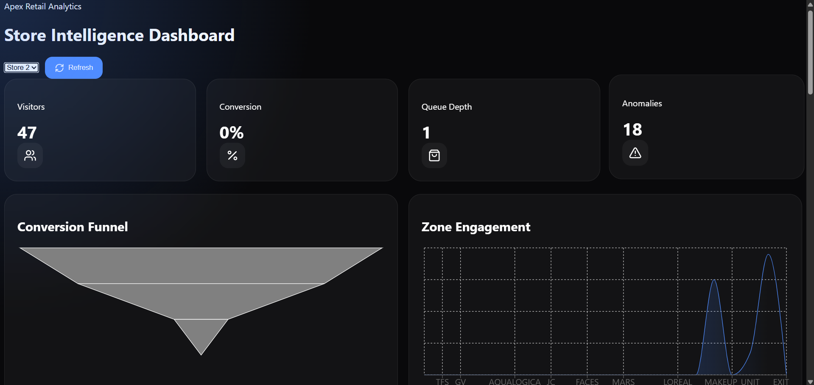
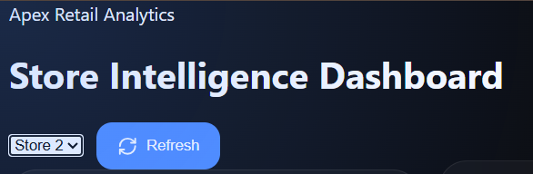
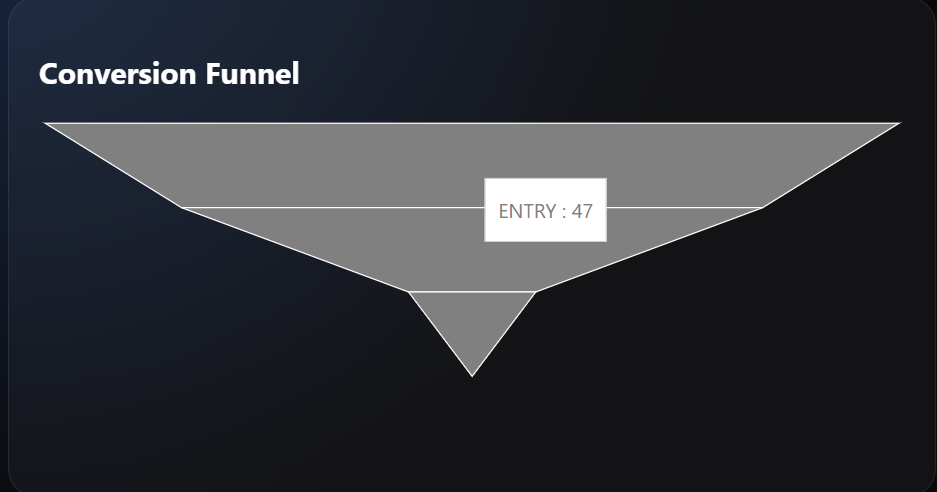
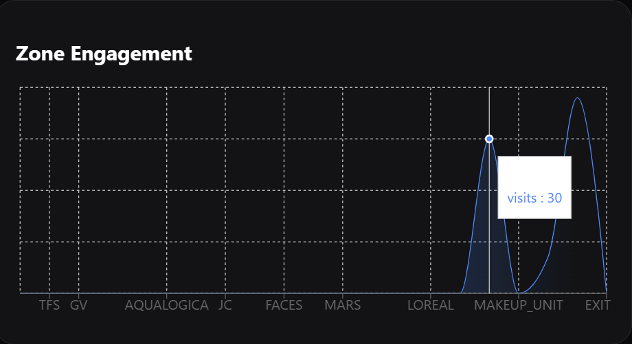

# Store Intelligence Platform

A multi-store retail analytics platform that transforms CCTV footage and POS transaction data into actionable business intelligence using Computer Vision, Event Processing, Fastify APIs, Prisma, and a modern React dashboard.

---

## Overview

Store Intelligence Platform is an end-to-end retail analytics system designed to convert raw CCTV footage and transaction data into meaningful business insights.

The platform automatically detects customer activity, tracks movement across store zones, generates structured retail events, correlates purchases, and visualizes store performance through an interactive dashboard.

### Problem Statement

Retail stores generate large amounts of CCTV footage every day, but very little actionable insight.

Store managers often struggle to answer questions such as:

* How many customers entered the store?
* Which sections receive the most engagement?
* Where are customers dropping off?
* How long are checkout queues?
* Which store is performing better?
* What operational anomalies require attention?

This platform transforms CCTV footage into measurable retail intelligence.

---

## Features

### CCTV Analytics

* YOLO-based customer detection
* Multi-camera visitor tracking
* Entry and exit detection
* Zone-level movement analysis
* Dwell-time measurement

### Event Intelligence

Converts raw video activity into structured events:

* ENTRY
* EXIT
* REENTRY
* ZONE_ENTER
* ZONE_EXIT
* ZONE_DWELL
* BILLING_QUEUE_JOIN
* BILLING_QUEUE_ABANDON

### Dashboard Analytics

* Visitor Counts
* Conversion Rate
* Queue Depth
* Conversion Funnel
* Zone Heatmaps
* Anomaly Detection

### Multi-Store Support

The platform supports multiple stores with independent:

* CCTV feeds
* Camera mappings
* Layout definitions
* Event datasets
* Analytics dashboards

Users can dynamically switch between stores from the dashboard.

---

## System Architecture

```text
CCTV Cameras
      │
      ▼
YOLO Detection
      │
      ▼
Visitor Tracking
      │
      ▼
Event Generation
      │
      ▼
JSONL Event Stream
      │
      ▼
Prisma Database
      │
      ▼
Fastify API
      │
      ▼
React Dashboard
```

---

## Dashboard Screenshots

### Main Dashboard



### Store Selection



### Conversion Funnel



### Zone Analytics



---

## Multi-Store Architecture

The platform currently supports two stores.

### Store 1

```text
store_001
```

Features:

* Dedicated CCTV feeds
* Independent layout mapping
* Independent camera mapping
* Separate analytics generation

### Store 2

```text
store_002
```

Features:

* Dedicated CCTV feeds
* Independent layout mapping
* Independent camera mapping
* Separate analytics generation

The dashboard can switch between stores without restarting any service.

---

## Analytics Explained

### Visitors

Tracks unique customer sessions entering the store.

### Conversion Rate

Measures how many visitors eventually make a purchase.

```text
Conversion Rate =
Purchasing Visitors ÷ Total Visitors
```

Example:

```text
100 Visitors
25 Purchases

Conversion Rate = 25%
```

### Queue Depth

Measures checkout congestion.

Example:

```text
Queue Depth = 8
```

indicates 8 customers waiting in the billing queue.

### Conversion Funnel

Visualizes customer progression through the store journey.

```text
100 Entered Store
        ↓
75 Browsed Products
        ↓
40 Reached Billing Area
        ↓
25 Purchased
```

Helps identify customer drop-off points.

### Heatmap Analytics

Shows customer engagement by zone.

Example:

```text
SNACKS        → 220 Visits
MARS          → 180 Visits
CASH_COUNTER  → 95 Visits
```

Used to identify popular and underperforming areas.

### Anomaly Detection

Automatically identifies unusual retail behavior.

Examples:

* Queue Spikes
* Conversion Drops
* Dead Zones
* Low Engagement Areas

---

## Technology Stack

### Frontend

* Next.js 14
* React
* TypeScript
* Zustand
* Recharts
* Framer Motion
* Lucide React

### Backend

* Fastify
* Prisma ORM
* SQLite

### Computer Vision

* Python
* YOLO
* OpenCV

### Infrastructure

* Docker
* Docker Compose
* PNPM Monorepo
* Turbo

---

## Repository Structure

```text
store-intelligence/
├── apps/
│   ├── api/
│   └── web/
│
├── packages/
│   ├── pipeline/
│   └── shared/
│
├── data/
│   ├── store1_videos/
│   ├── store2_videos/
│   ├── store1_layout.json
│   ├── store2_layout.json
│   ├── store1_camera_map.json
│   ├── store2_camera_map.json
│   ├── store1_events.jsonl
│   ├── store2_events.jsonl
│   ├── all_events.jsonl
│   └── events.jsonl
│
├── docs/
├── docker-compose.yml
└── README.md
```

---

## Event Processing Pipeline

### Store 1

```bash
python packages/pipeline/emit.py \
  --videos data/store1_videos \
  --layout data/store1_layout.json \
  --camera-map data/store1_camera_map.json \
  --output data/store1_events.jsonl
```

### Store 2

```bash
python packages/pipeline/emit.py \
  --videos data/store2_videos \
  --layout data/store2_layout.json \
  --camera-map data/store2_camera_map.json \
  --output data/store2_events.jsonl
```

### Combined Dataset

Both stores are merged into:

```text
data/all_events.jsonl
```

Current dataset contains:

```text
2145+ Generated Retail Events
```

---

## API Endpoints

Base URL:

```text
http://localhost:4000
```

| Method | Endpoint              | Description       |
| ------ | --------------------- | ----------------- |
| GET    | /stores/:id/metrics   | Store KPIs        |
| GET    | /stores/:id/funnel    | Conversion Funnel |
| GET    | /stores/:id/heatmap   | Zone Analytics    |
| GET    | /stores/:id/anomalies | Retail Anomalies  |
| POST   | /events/ingest        | Event Ingestion   |
| GET    | /health               | Service Health    |

---

## Docker Deployment

Start the complete application stack:

```bash
docker compose up
```

Services:

```text
Frontend : http://localhost:3000
Backend  : http://localhost:4000
```

---

## Local Development

Install dependencies:

```bash
pnpm install
```

Seed the database:

```bash
pnpm db:seed
```

Run the application:

```bash
docker compose up
```

---

## Engineering Challenges Solved

### Multi-Camera Tracking

Maintained visitor identity across multiple camera feeds.

### Zone Mapping

Mapped customer positions into business-relevant store zones.

### Event Standardization

Converted raw detections into structured retail events.

### Multi-Store Scalability

Extended the system from a single-store prototype into a multi-store analytics platform.

---

## Results

Dataset Processed:

* 2 Retail Stores
* Multiple CCTV Feeds
* 2145+ Generated Events
* Multiple Customer Sessions

Generated Metrics:

* Visitor Counts
* Conversion Rates
* Queue Depth
* Heatmaps
* Conversion Funnels
* Anomaly Reports

---

## Future Improvements

* Real-time RTSP stream ingestion
* PostgreSQL deployment
* Cross-camera Re-Identification
* WebSocket dashboard streaming
* Staff identification models
* Queue prediction
* Multi-branch benchmarking

---

## Impact

This project demonstrates how raw CCTV footage can be transformed into actionable business intelligence through:

* Computer Vision
* Event Processing
* Database Design
* API Engineering
* Dashboard Development
* Containerized Deployment

The platform provides retailers with meaningful operational insights that can improve customer experience, store performance, and business decision-making.
